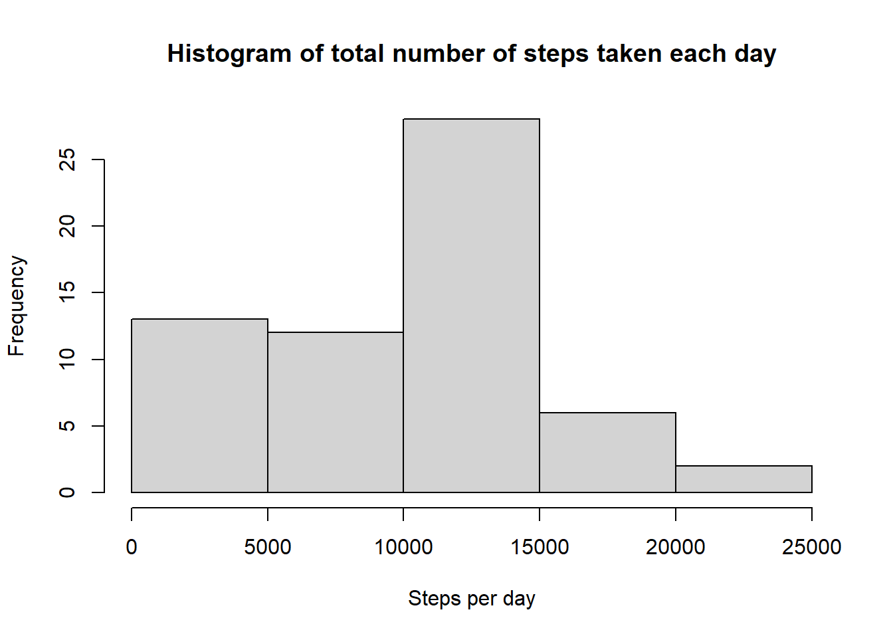
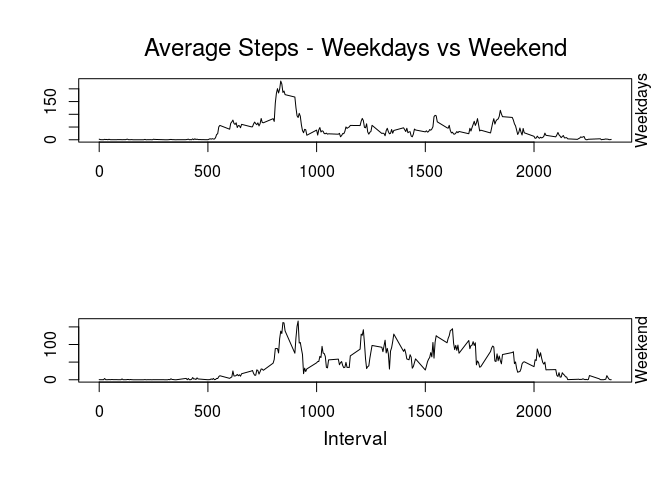

Loading and Preprocessing data

```r
data <- read.csv("activity.csv")
data$date<-as.Date(data$date,format = "%Y-%m-%d")
```

Total number of steps taken per day

```r
library(dplyr)
stepsperday <- data %>% 
        group_by(date) %>%
        summarise(steps_per_day=sum(steps, na.rm = T))
```

Histogram of the total number of steps taken each day


```r
hist(stepsperday$steps_per_day,
     xlab ="Steps per day",
     main = "Histogram of total number of steps taken each day"
)
```

<!-- -->

Calculation of mean and median of the total number of steps taken per day


```r
mn <- mean(stepsperday$steps_per_day)
mdn <- median(stepsperday$steps_per_day)
```

The mean of total steps taken per day is 9354.2295082 and the median 10395


```r
AvrgStepsPerInt <- data %>%
        group_by(interval) %>%
        summarise(AverageSteps=mean(steps,na.rm = T))
```

```
## `summarise()` ungrouping output (override with `.groups` argument)
```

```r
plot(AvrgStepsPerInt$interval,
     AvrgStepsPerInt$AverageSteps, 
     type="l", 
     xlab="Interval",
     ylab= "Average Steps", 
     main="Average Steps per 5 min interval"
)
```

<!-- -->

Calculation of 5-minute interval which has on average across all the days,the maximum number of steps


```r
maxstepsinterval <- which(AvrgStepsPerInt$AverageSteps==max(AvrgStepsPerInt$AverageSteps))
```

The 5-minute interval which has on average the maximum number of steps is 835


Calculation of the total number of missing values in the dataset


```r
missingValues <- sum(is.na(data))
```

The total number of missing values is 2304

Filling of missing Values


```r
#creating new dataset to be filled 
FilledDataset <- data

for (i in 1:nrow(FilledDataset)){
        
        #finding the average steps per 5 minute interval of the corresponding day
        IntIndic <- which(AvrgStepsPerInt$interval==FilledDataset$interval[i])
        
        if (is.na(FilledDataset$steps[i] == T)) {
                FilledDataset$steps[i] <- AvrgStepsPerInt$AverageSteps[IntIndic]
        }
}
```


```r
stepsperdayfilled <- FilledDataset %>% 
        group_by(date) %>%
        summarise(steps_per_day=sum(steps, na.rm = T))
```

```
## `summarise()` ungrouping output (override with `.groups` argument)
```

```r
hist(stepsperdayfilled$steps_per_day,
     xlab ="Steps per day",
     main = "Histogram of total number of steps taken each day (NAs Filled)"
)
```

<!-- -->

Calculation the mean and median of the new dataset

```r
mnfld <- mean(stepsperdayfilled$steps_per_day)
mdnfld <- median(stepsperdayfilled$steps_per_day)
```


The mean and median of total number of steps taken each day, after the NAs were filled is 10766.19, 10766.19 respectively. Both values changed from the estimates of the first part. The imputing of missing data moved the median a little higher but had bigger effect on the mean value. It is worthy to note that they have the same value after the imputation.


Creating a new variable which indicates if the corresponding day is weekend or weekday


```r
FilledDataset$TypeOfDay <- "Weekday"

FilledDataset$TypeOfDay[weekdays(FilledDataset$date) %in% c("Saturday" , "Sunday")] <- "Weekend"

FilledDataset$TypeOfDay <- as.factor(FilledDataset$TypeOfDay)
```


Creating the two plots to compare the activity of weekdays vs weekends

```r
AvrgStepsPerIntFilled <- FilledDataset %>%
        group_by(TypeOfDay, interval) %>%
        summarise(AverageSteps=mean(steps)) %>% 
        ungroup()


wkdayIndic <- AvrgStepsPerIntFilled$TypeOfDay=="Weekday"
wkendIndic <- AvrgStepsPerIntFilled$TypeOfDay=="Weekend"

par(mfrow=c(2,1),ann=F)

plot(AvrgStepsPerIntFilled$interval[wkdayIndic],
     AvrgStepsPerIntFilled$AverageSteps[wkdayIndic],
     type = "l",
     )
mtext("Weekdays", side=4, cex=1)
mtext("Average Steps - Weekdays vs Weekend", side=3, cex=1.5, line=1)

plot(AvrgStepsPerIntFilled$interval[wkendIndic],
     AvrgStepsPerIntFilled$AverageSteps[wkendIndic],
     type = "l"
     )

mtext("Weekend", side=4, cex=1)
mtext("Interval", side=1, cex=1.2,line= 2.5)
```

<!-- -->


From the two plots we can observe that people tend to start their day earlier during weekdays. Both of them are fluctuating but during weekends there is a significant higher level of activity throughout the day 


